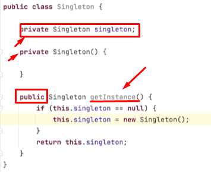

# Padrões de Projetos

    Designe Paterns

--> Padrões GRASP

--> Padrões GOF

### Exemplos

    https://github.com/digaomilleniun/backend-java-ebac 
    
    https://www.devmedia.com.br/entendendo-os-conceitos-dos-padroes-de-projetos-em-java/29083 
    
    http://integu.net/factory-pattern/ https://refactoring.guru/pt-br/design-patterns/java

# Singleton

Ele cria um construtor privado e verifica se é nullo, assim ele só instancia a classe uma vez, já que na primeira é nullo, na próxima só retorna o singleton.

# Resumo

Exmplo geral usando factory,mas pode usar para builder e singleton.

Criação do carro/hamburguer:

    Objeto -> Car ou Hamburguer (O que o carro/hamburguer tem)

    Receita -> Brasilia/Corola CheeseBurger/VeganBurguer (Dois tipos de carro/hamburguer)
    
    Builder (Factory/BurguerBuilder) -> O que cria o carro/hamburguer
    
    Contrato -> Qual o tipo de carro para o builder criar (Hamburguer não tem)
    
    Customer ou Gerente -> Faz a requisição da contrução do carro/hamburguer
    
    Demo -> Método que da as informações para a criação do carro/hamburguer

# Tarefa

Abstratact Method Factory, fábrica de carros.